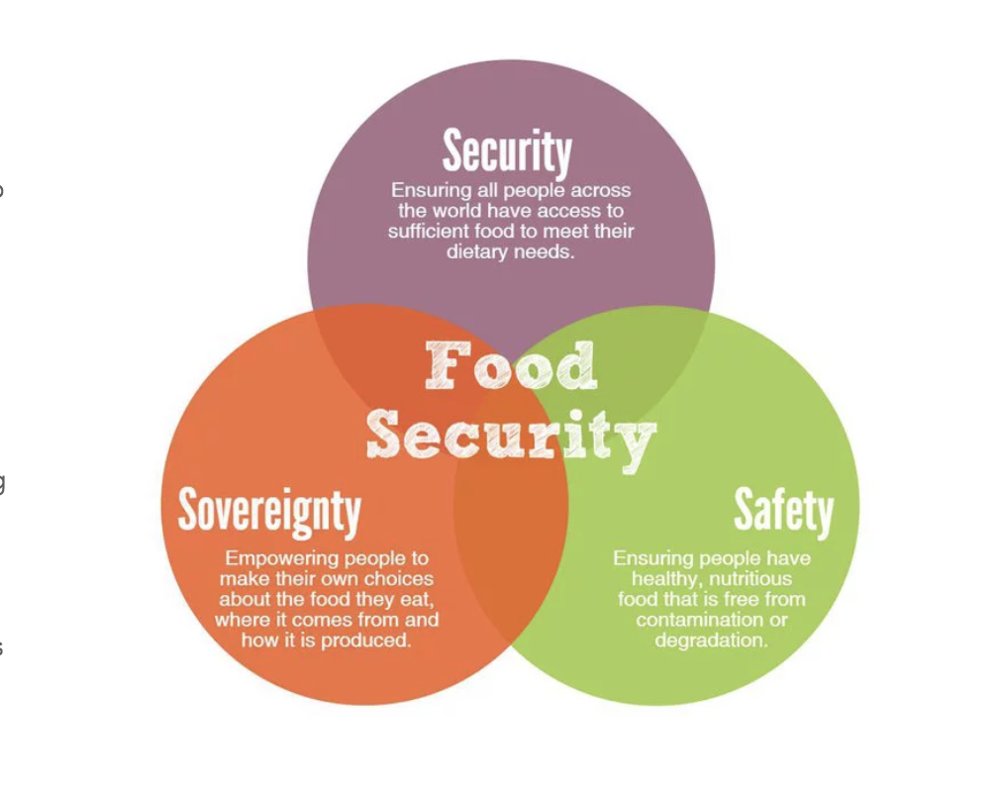

# Food Security in the United States

Repo for the final project of **Population Health Informatics** by Information School, University of Washington.

__Abstract__ : With increasing population and consumption growth, it is predicted that the global demand for food will increase for at least another 40 years. A multifaceted and linked national strategy is needed to ensure sustainable and equitable Food Security in the United States. This paper explores three different spheres that affect Food Security, that is, Food Affordability, Nutrition, and Food Accessibility. It analyzes each of the three spheres across different states and regions in the United States and presents results for the same. The preliminary results across all categories reveal Alaska as the most food-secure state in the country; while District of Columbia, West Virginia, Arkansas and Massachusetts were identified currently at the highest risk for food security. This study also aims to find clusters of geographic locations, based on accessibility, affordability, and nutrition. To do so, the study uses K-Means clustering as an unsupervised statistical model; the results show that with sufficient evidence for further exploration that there is a relationship between Food Security and geographic location of a state. Along with this report, the authors also developed a ​Shiny web application that can be used to interact and further explore the analysis.

For more information on our data, methods and findings go through the paper in the repo.

Interactive Visualizations can be found at [Shiny App](https://simran18.shinyapps.io/the-food-rise)
